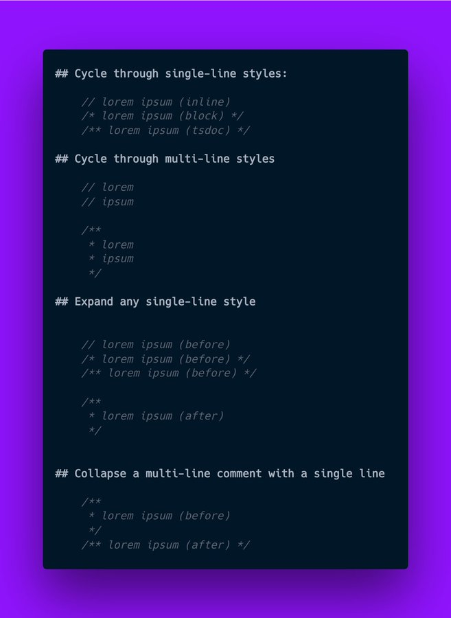

# Cycle Comment Styles README

This is a VSCode extension inspired by Jamie Kyle's 
[tweet requesting this functionality](https://twitter.com/buildsghost/status/1514692171131097097). 
This is my first VSCode extension, and my first open-source project, so I hope you enjoy it!

## Features

This extension should work exactly like the screenshot below. I used this as a guide 
for exactly how this should behave!

## Extension Settings

This extension contributes the following settings:

* `cycle-comment-styles.singleLineCommentStyle`: Whether to cycle comment styles or convert to a single specific style for single-line comments. Valid values are `default`, `//`, `/*`, and `/**`
* `cycle-comment-styles.multiLineCommentStyle`: Whether to cycle comment styles or convert to a single specific style for multi-line comments. Valid values are `default`, `//`, and `/**`
* `cycle-comment-styles.collapsedLineSeparator`: When a multi-line comment is collapsed, this is the separator that will repalce each newline (\n)

<!-- ## Known Issues

Calling out known issues can help limit users opening duplicate issues against your extension. -->

## Release Notes

### 1.0.0

Initial release of Cycle Comment Styles